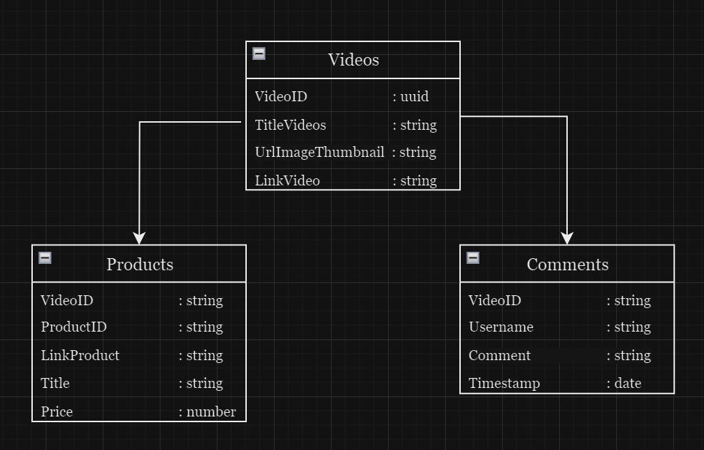
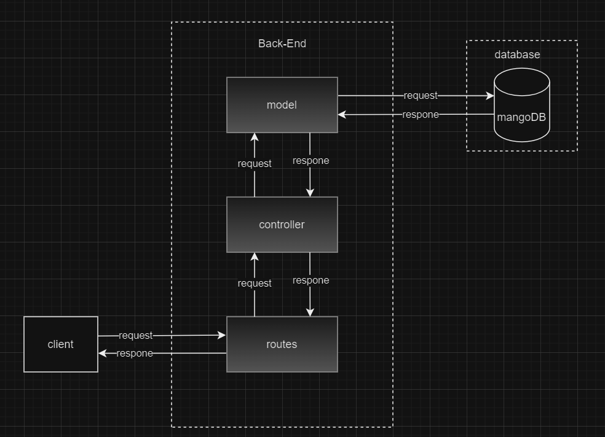

# gigih_midterm

## Table of Contents

- [Introduction](#introduction)
- [Database Structure](#database-structure)
- [API Structure](#api-structure)
- [List of API Endpoints](#list-of-api-endpoints)
- [How to Run Locally](#how-to-run-locally)

## Introduction

This repository contains the backend implementation of the Tokopedia Play Clone, a video streaming platform. The backend is built using Node.js, Express.js, and MongoDB.

## Database Structure

The MongoDB database used for this project contains three collections: `Videos`, `Products`, and `Comments`.



### Videos

This collection contains data about videos. The schema is as follows:

```json
{
  "VideoID": "uuid",
  "TitleVideo": "string",
  "UrlImageThumbnail": "string",
  "LinkVideo": "string"
}
```

### Products

This collection contains data about products. The schema is as follows:

```json
{
  "VideoID": "String",
  "ProductID": "string",
  "LinkProduct": "String",
  "Title": "String",
  "Price": "Number"
}
```

### Comments

This collection contains data about comments. The schema is as follows:

```json
{
  "VideoID": "String",
  "Username": { "type: String, required: true" },
  "Comment": { "type: String, required: true" },
  "Timestamp": { "type: Date, default: Date.now" }
}
```

## API Structure

#### API Structure Design :

on this structure API, I use folder structure :

**Data Acces :**

- Models :
- Controller :
- Routes :



The backend follows a RESTful API design, using Express.js to handle routes and controllers to handle the logic for each endpoint.

- The `VideosController.js` handles video-related API endpoints.
- The `ProductController.js` handles product-related API endpoints.
- The `CommentController.js` handles comment-related API endpoints.

## List API request and response

### GET /api/videos

---

Returns all users in the system.

- **URL Params**  
  None
- **Data Params**  
  None
- **Headers**  
  Content-Type: application/json
- **Success Response:**
- **Code:** 200  
  **Content:**

```json
[
  {
    "_id": "64c3c7713176cca275313bcd",
    "VideoID": "97fcea2f-84d3-4b14-9d20-a5e90ba4d23e",
    "Title": "Baju Oversize",
    "UrlImageThumb": "https://images.tokopedia.net/img/cache/900/VqbcmM/2022/12/24/9eb0fb35-8d2c-4a8e-88f8-e8934eb6edf8.jpg",
    "UrlVideo": "https://youtu.be/kRg8PXQVpbw"
  }
]
```

- **Error Response:**
  - **Code:** 500  
    **Content:** `{ error : "Error fetching video thumbnails" }`

### POST /api/videos

---

Create new videos

- **URL Params**  
  None
- **Data Params**
  ```json
  {
    "titleVideo": "string",
    "urlImageThumbnail": "string",
    "urlVideo": "string"
  }
  ```
- **Headers**  
  Content-Type: application/json
- **Success Response:**
- **Code:** 200  
  **Content:**

```json
{
  "VideoID": "1bfa09b5-95ef-409b-83a8-51f1cbae4c05",
  "TitleVideo": "Trust Denim",
  "UrlImageThumbnail": "https://images.tokopedia.net/img/cache/900/VqbcmM/2023/7/26/eeaa5f7b-d8cb-449d-a00d-86b5760f038e.jpg",
  "UrlVideo": "https://youtu.be/9S628EBdizY",
  "_id": "64c4f02dac4157c70f56e9fe",
  "__v": 0
}
```

- **Error Response:**
  - **Code:** 500  
    **Content:** `{ error : "error creating video" }`

### GET /api/videos/:videoId/products

---

Returns all Product associated with the specified video.

- **URL Params**  
  Required: videoId=[string]
- **Data Params**  
  None
- **Headers**  
  Content-Type: application/json
- **Success Response:**
- **Code:** 200  
  **Content:**

```json
[
  {
    "_id": "64c3d3ce3176cca275313bd4",
    "VideoID": "2",
    "ProductID": "4",
    "LinkProduct": "link.com",
    "Title": "Product 4",
    "Price": 1000
  }
]
```

- **Error Response:**
  - **Code:** 500  
    **Content:** `{ error : "Error fetching products" }`

### GET /api/videos/:videoId/comments

---

Returns all Comments associated with the specified video.

- **URL Params**  
  Required: videoId=[string]
- **Data Params**  
  None
- **Headers**  
  Content-Type: application/json
- **Success Response:**
- **Code:** 200  
  **Content:**

```json
[
  {
    "_id": "64c3f23a7df654dc65407a04",
    "VideoID": "2",
    "Username": "adit",
    "Comment": "barangnya lengkap banget",
    "Timestamp": "2023-07-28T16:52:10.583Z",
    "__v": 0
  }
]
```

- **Error Response:**
  - **Code:** 500  
    **Content:** `{ error : "error fetching comment" }`

### POST /api/videos/:videoId/comments

---

Create Comment in the specified video.

- **URL Params**  
  None
- **Data Params**
  ```json
  {
    "username": string,
    "comment": string
  }
  ```
- **Headers**  
  Content-Type: application/json
- **Success Response:**
- **Code:** 200  
  **Content:**

```json
{
  "username": "adit",
  "comment": "barangnya lengkap banget"
}
```

- **Error Response:**
  - **Code:** 500  
    **Content:** `{ error : "error creating comment" }`

## How to run

To run the backend API locally on your machine, follow these steps:

1. Clone this repository to your local machine.
2. Install Node.js and npm if you haven't already.
3. Install the required dependencies by running `npm install` in the project root directory.
4. Set up a MongoDB database locally with name `tokopedia-play-clone`.
5. Start the server by running `npm run start`. The server will start running at `http://localhost:3000`.
